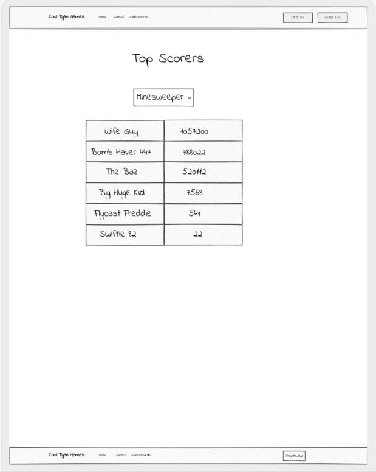
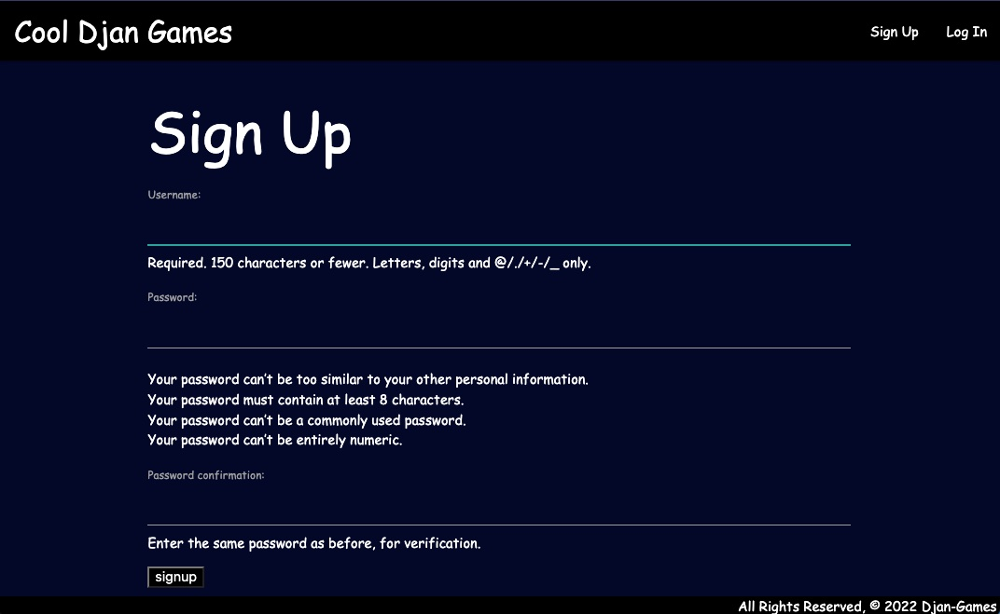
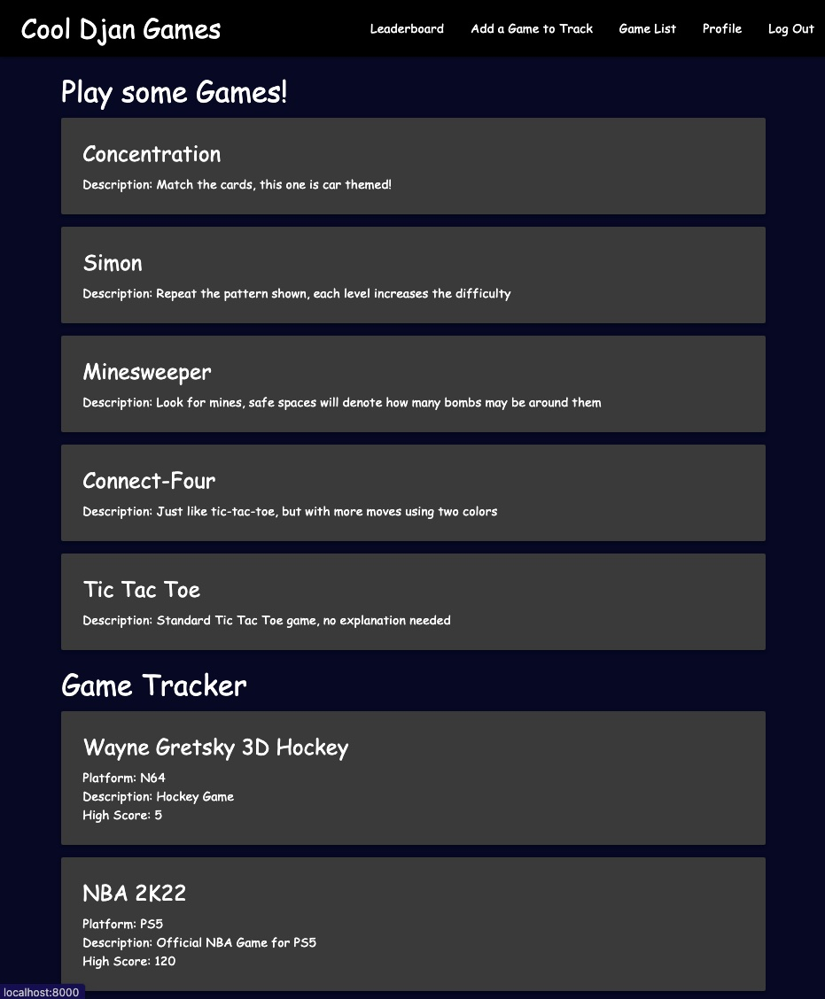
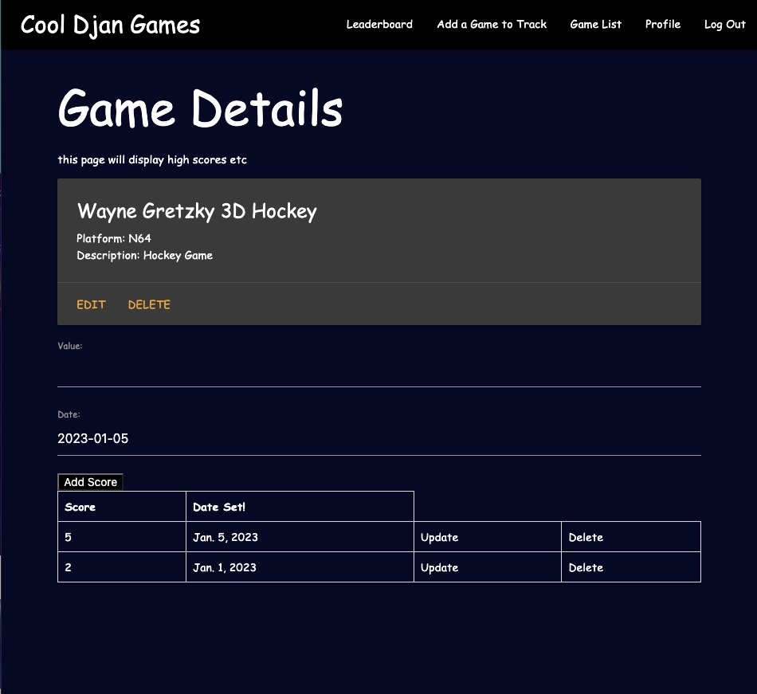
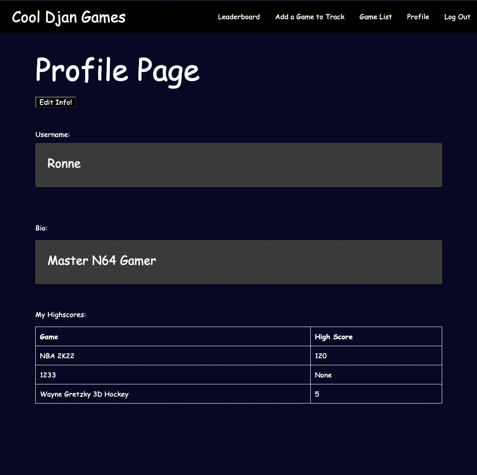
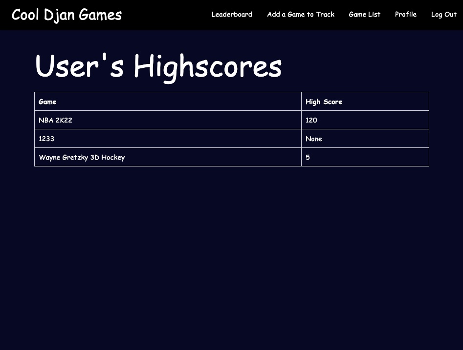

# **Cool Djan Games**

### ***-Cool Djan Games was inspired by Cool Math Games. In our version, you will be able to play games, and in addition you will be able to track high scores from any of your favorites games***

## **Wireframes:**

## **Actual Screenshots:**

&nbsp;
## **ERD Model:**

## **Technologies Used:**
- HTML
- CSS
- Python
- Django
- Javascript
&nbsp;
## **Getting Started:**
&nbsp;
Link to the game: https://shielded-spire-28536.herokuapp.com/
&nbsp;
## **Future Enhancements:**
- ability to see other signed up users' high scores
- ability to add high score directly from playable games
- A.I. logic for tic tac toe

