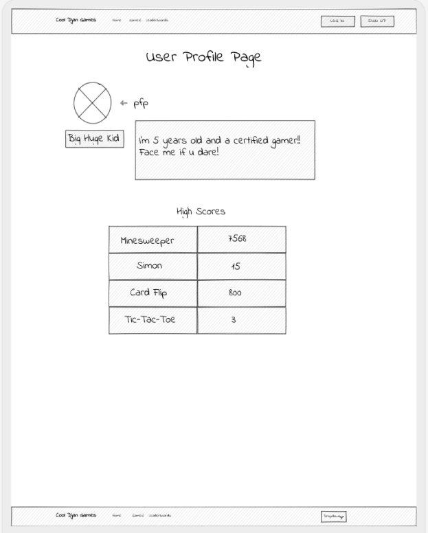

# **Cool Djan Games**

### ***-Cool Djan Games was inspired by Cool Math Games. In our version, you will be able to play games, and in addition you will be able to track high scores from any of your favorites games***

## **Wireframes:**

## **Actual Screenshots:**

&nbsp;
## **ERD Model:**

## **Technologies Used:**
- HTML
- CSS
- Python
- Django
- Javascript
&nbsp;
## **Getting Started:**
&nbsp;
Link to the game: 
&nbsp;
## **Next Steps:**
&nbsp;
Future Enhancements will include: 

